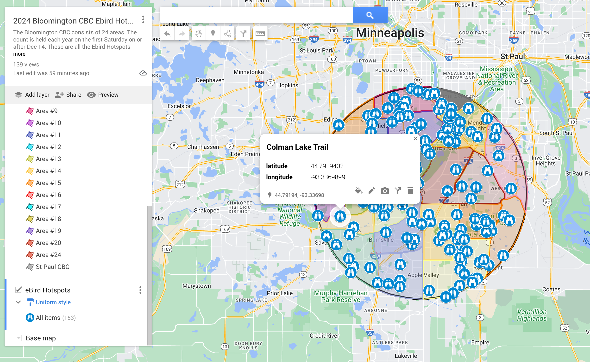

## Mapping Utils

One of the things I do leading up to the CBC is to provide a map of recent sightings found within the count circle, leveraging the eBird API.
It originally started with CSV as the only output, but more recently I've been working on KML/KMZ output as well. Stay tuned for that. I also
intend to package this up as a Python wheel for easier installation and use.

This will pull the following from eBird, within the set radius:

* Recent notable sightings
* Recent sightings (not notable)
* Hotspots

It uses the eBird API, documented at: https://documenter.getpostman.com/view/664302/S1ENwy59.

JSON from eBird is parsed into CSV files, which can be imported into a Google map. That will place the
eBird locations on a map.

Add a layer in the map for each CSV, and import the csv into the map.
Latitude and longitude are used to place the locations on the map. I usually
use the name field as the label.

Within Google Maps, you can adjust the color and icons for the points. 

### Setup

1. Clone this project
2. Install pyenv, see https://github.com/pyenv/pyenv
3. To set up the project run `source ./setup.sh` in the root of the project.  

### Run
1. Update the values in `.env`.
   * You'll need to sign up for an eBird API key at ebird.org.
2. `python src/circle_data.py`

Here's an example of how this data can be used. Have a look at https://www.bloomingtoncbc.org/maps to see some more examples. Happy CBCing!

